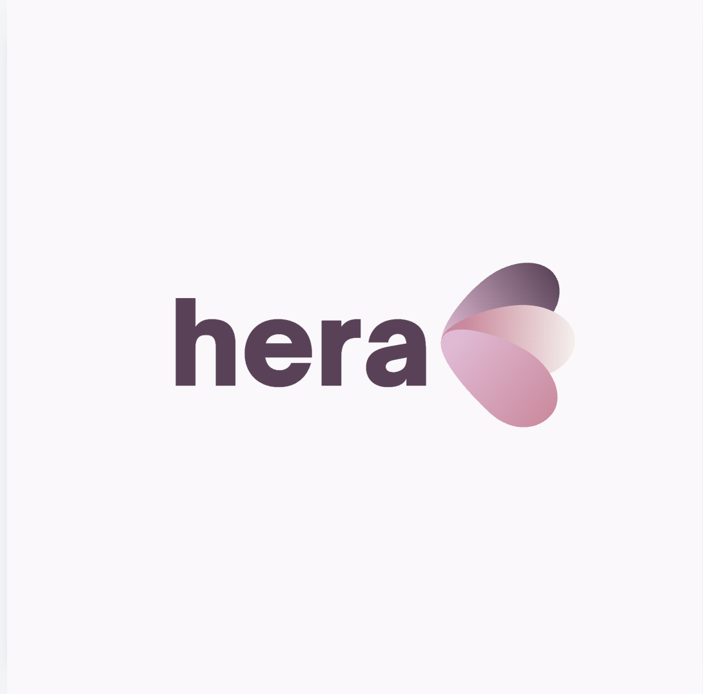

<!-- PROJECT SHIELDS -->
[![contributors][contributors-shield]][contributors-url]
[![issues][issues-shield]][issues-url]
[![commits][commits-shield]][commits-url]

<!-- PROJECT LOGO --> 
<br />
<div align="center">
  <a href=“https://github.com/UW-INFO442-AU24/Team-Pesto”> 
    
  </a>

  <h1 align="center">hera</h1>

  <p align="center">
    An application designed to support mothers experiencing postpartum depression by providing tools for mood tracking, self-assessment, community support, and access to educational resources.
    <br />
  </p>
</div>

<!-- TABLE OF CONTENTS -->
<details>
  <summary>Table of Contents</summary>
  <ol>
    <li>
      <a href="#about-the-project">About The Project</a>
      <ul>
        <li><a href="#built-with">Built With</a></li>
      </ul>
    </li>
    <li>
      <a href="#getting-started">Getting Started</a>
      <ul>
        <li><a href="#prerequisites">Prerequisites</a></li>
            <ul>
                <li><a href="#frontend">Frontend</a></li>
                <li><a href="#backend">Backend</a></li>
            </ul>
        <li><a href="#installation">Installation</a></li>
      </ul>
    </li>
    <li><a href="#roadmap">Roadmap</a></li>
    <li><a href="#contact">Contact</a></li>
  </ol>
</details>

<!-- ABOUT THE PROJECT -->

## About The Project

<!-- [![Product Name Screen Shot][product-screenshot]](www.example.com) -->

This application is designed to support mothers experiencing postpartum depression by providing tools for mood tracking, self-assessment, community support, and access to educational resources.

### Objective

This project focuses on the United Nations Sustainable Development Goal (SDG) 3: Good Health and Well-Being. Specifically, we are addressing the question: How might we provide accessible and personalized mental health resources to young mothers (18-26) to help them manage postpartum depression (PPD) so they feel more empowered in their postpartum journey?

### Background

Postpartum depression is a serious mental health condition that affects approximately 13% of mothers globally. In developing countries, this number rises to almost 20%. It can have severe consequences for both the mother and the child, impacting bonding, child development, and overall family well-being. The causes of PPD are multifaceted, including hormonal changes, lack of sleep, social isolation, and the overwhelming responsibility of caring for a newborn.

### Current Understanding

From our current understanding, a “rapid drop in estrogen and progesterone levels after delivery, coupled with the stress and sleep deprivation… can trigger depressive episodes” for mothers (Carlson, 2024). There are many new challenges in caring for a newborn, like breastfeeding, which can cause mental health strain. There are treatments available, including psychotherapy and antidepressant medications; however, “Patients with severe PPD may not respond to psychotherapy or pharmacotherapy” (Carlson, 2024). We also understand that even if PPD is treated, there can “be a risk for future episodes of major depression,” but we want to provide more support systems and resources to mothers struggling to ensure PPD is not as severe. It is crucial that positive parenting starts early on as “Neuroscientists discovered that positive parenting contributes to better functioning in the brain regions associated with emotions and cognition during the teen years” (UC Davis Health, n.d.). If a young mother is struggling with PPD, it may be challenging for her to take care of newborns as they require a lot of nurturing.

### Approach

Our project plans to isolate two key causes that we aim to address: social isolation and lack of accessible mental health resources. We believe that personalized mental health tools, such as mood tracking, self-assessment, and easily accessible educational resources, would significantly improve the well-being of mothers struggling with PPD. Additionally, access to community and partner support resources has been shown to positively affect maternal mental health, which will also be a focal point of our solution.

Research from sources such as the World Health Organization and NCBI highlights the impact of easily accessible mental health resources. The goal of our project is to create an accessible, user-friendly platform where mothers affected by PPD can have access to personalized resources tailored to their own specific needs. This may look like community-building features and message boards to decrease the feeling of isolation and mood tracking features to enable mothers to monitor their symptoms. We want to de-stigmatize PPD and help young mothers recognize their symptoms and understand that this response isn’t uncommon. By addressing the self-isolation that comes with PPD and the lack of personalized resources available to young mothers, we hope to create a solution that will empower mothers and aid them in better managing their postpartum depression, contributing to SDG 3: Good Health and Well-Being.

We also understand that there are some resources that provide similar services, including postpartum.net, which has a helpline for emergencies and non-emergencies, and themotherhoodcenter.com, which provides a program including therapy, medication, and other mindful practices. However, we want to iterate and improve upon these ideas to younger mothers who may be struggling or following a different timeline and tailor our solution to them. They may not have time to participate in day programs, and we want to ensure that they feel just as empowered.

<p align=“right”>(<a href=“#readme-top”>back to top</a>)</p>

### Testing Protocal
[Testing Protocal & Bugs](https://docs.google.com/document/d/1LuXIaYh0Dhm2Kribh1irXMyRY1zQmrn7Pf-qLse8ft8/edit?usp=sharing)

### Built With

* [![React][React.js]][React-url]
* [![TailwindCSS][TailwindCSS]][TailwindCSS-url]
* [![Python][Python]][Python-url]
* [![SQLAlchemy][SQLAlchemy]][SQLAlchemy-url]
* [![FastAPI][FastAPI]][FastAPI-url]
* [![PostgreSQL][PostgreSQL]][PostgreSQL-url]
* [![Firebase][Firebase]][Firebase-url]
* [![Microsoft-Azure][Microsoft-Azure]][Microsoft-Azure-url]

<p align=“right”>(<a href=“#readme-top”>back to top</a>)</p>

<!-- GETTING STARTED -->

## Getting Started

 To get a local copy up and running follow these steps.

### Prerequisites
-   Python 3.12+
-   Node.js 20+
-   npm 10+

### Installation

#### Frontend
1.  Install Node.js and npm
    
    ```sh
    # install nvm (Node Version Manager)
    curl -o- https://raw.githubusercontent.com/nvm-sh/nvm/v0.40.0/install.sh

    # download and install Node.js and npm
    npm install 20
    ```
    
2.  Navigate to the frontend directory
    
    ```sh
    cd frontend
    ```

3.  Install frontend dependencies
    
    ```sh
    npm install
    ```

4.  Start the React development server
    
    ```sh
    npm start
    ```

#### Backend
<!-- NOTE: LOOK INTO SEEING IF NOT YOU NEED TO DO ALEMBIC COMMANDS TO GET TABLES? IDK -->
1.  Clone the repo
    
    ```sh
    git clone https://github.com/UW-INFO442-AU24/Team-Pesto.git
    ```
    
2.  Create and activate a virtual environment
    ```sh
    python -m venv .venv
    source .venv/bin/activate  # On Windows, use `.venv\Scripts\activate`
    ```
    
4.  Install postgresql
   
    #### On macOS:
    ```sh
    brew install postgresql
    ```

    #### On Windows:
    
    Follow the instructions on the redis website linked [here](https://www.postgresql.org/download/windows/)
    
6.  Install backend dependencies
    
    ```sh
    pip install -r requirements.txt
    ```

7.  Set up environment variables - Create a .env file in the root directory and add the Azure Postgresql DB URL along with other env info:

    ```sh
    DATABASE_URL="teampesto-dev-westus-001.postgres.database.azure.com"
    ```

8. Install and start Redis:

    #### On macOS:
    ```sh
    brew install redis
    brew services start redis
    ```

    #### On Windows:
    Follow the instructions on the redis website linked [here](https://redis.io/docs/latest/operate/oss_and_stack/install/install-redis/install-redis-on-windows/)

9.  Run database migrations:
    
    ```py
    python -c "from ..db_setup import Base, engine; Base.metadata.create_all(bind=engine)"
    ```

10.  Start the FastAPI server:
    
    ```sh
    uvicorn app.main:app --reload
    ```
    

<p align=“right”>(<a href=“#readme-top”>back to top</a>)</p>

<!-- ROADMAP -->

## Roadmap

-   [x] Login/Sign-up
-   [x] Data input through self-assessments, mood tracking, etc.
-   [x] Self-assessments based on professional quizzes online
-   [x] Page for mental health resources
-   [x] Page for community/partner support resources
-   [x] Privacy and security - data protection
-   [x] Education about postpartum depression
-   [x] Resource to find a therapist/online therapy support
-   [x] Data visualization tools (e.g., graphs, charts)

<!-- CONTACT -->
## Contact

<p>Joey Kang - <a href="https://www.linkedin.com/in/joey--kang/">LinkedIn</a> - <a href= "mailto: joeykang@uw.edu"> joeykang@uw.edu </a></p>
<p>Katie Shi - <a href="https://www.linkedin.com/in/katie-shi-ab4973185/">LinkedIn</a> - <a href= "mailto: katieshi@uw.edu"> katieshi@uw.edu </a></p>
<p>Safa Jamal - <a href="https://www.linkedin.com/in/safa-jamal/">LinkedIn</a> - <a href= "mailto: safaj03@uw.edu"> safaj03@uw.edu </a></p>
<p>Mynah Shetty - <a href="https://www.linkedin.com/in/mynahshetty/">LinkedIn</a> - <a href= "mailto: mshett@uw.edu"> mshett@uw.edu </a></p>
<p>Mira Nair - <a href="https://www.linkedin.com/in/miranair/">LinkedIn</a> - <a href= "mailto: miranair@uw.edu"> miranair@uw.edu </a></p>

<p align="right">(<a href="#readme-top">back to top</a>)</p>

<!-- MARKDOWN LINKS & IMAGES -->
[contributors-shield]: https://img.shields.io/github/contributors/UW-INFO442-AU24/Team-Pesto?style=for-the-badge&color=rgb(68%2C%20204%2C%2017)
[contributors-url]: https://github.com/UW-INFO442-AU24/Team-Pesto/graphs/contributors
[commits-shield]: https://img.shields.io/github/commit-activity/t/UW-INFO442-AU24/Team-Pesto?style=for-the-badge
[commits-url]: https://github.com/UW-INFO442-AU24/Team-Pesto/commits/main/
[issues-shield]: https://img.shields.io/github/issues/UW-INFO442-AU24/Team-Pesto?style=for-the-badge
[issues-url]: https://github.com/UW-INFO442-AU24/Team-Pesto/issues
[React.js]: https://img.shields.io/badge/React-20232A?style=for-the-badge&logo=react&logoColor=61DAFB
[React-url]: https://reactjs.org/
[Python]: https://img.shields.io/badge/python-3670A0?style=for-the-badge&logo=python&logoColor=ffdd54
[Python-url]: https://www.python.org/
[FastAPI]: https://img.shields.io/badge/FastAPI-005571?style=for-the-badge&logo=fastapi
[FastAPI-url]: https://fastapi.tiangolo.com/
[Microsoft-Azure]: https://custom-icon-badges.demolab.com/badge/Microsoft%20Azure-0089D6?style=for-the-badge&logo=msazure&logoColor=white
[Microsoft-Azure-url]: https://azure.microsoft.com/
[Firebase]: https://img.shields.io/badge/firebase-ffca28?style=for-the-badge&logo=firebase&logoColor=black
[Firebase-url]: https://firebase.google.com/
[PostgreSQL]: https://img.shields.io/badge/postgresql-4169e1?style=for-the-badge&logo=postgresql&logoColor=white
[PostgreSQL-url]: https://www.postgresql.org/
[SQLAlchemy]: https://img.shields.io/badge/SQLAlchemy-F9DC3E?style=for-the-badge&logo=sqlalchemy&logoColor=black
[SQLAlchemy-url]: https://www.sqlalchemy.org/
[TailwindCSS]: https://img.shields.io/badge/Tailwind_CSS-grey?style=for-the-badge&logo=tailwind-css&logoColor=38B2AC
[TailwindCSS-url]: https://tailwindcss.com/
